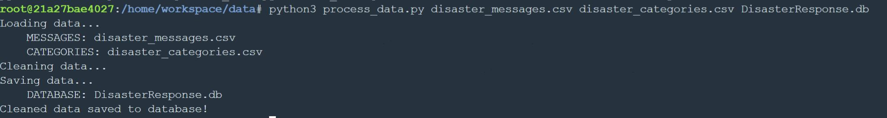
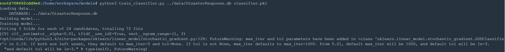
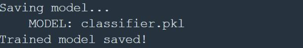
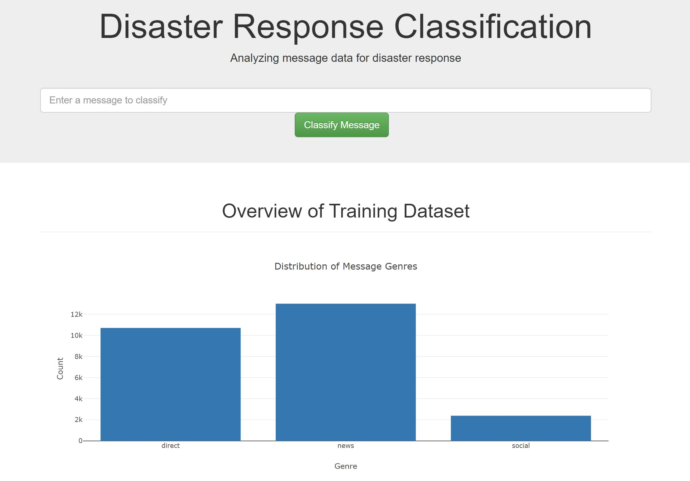
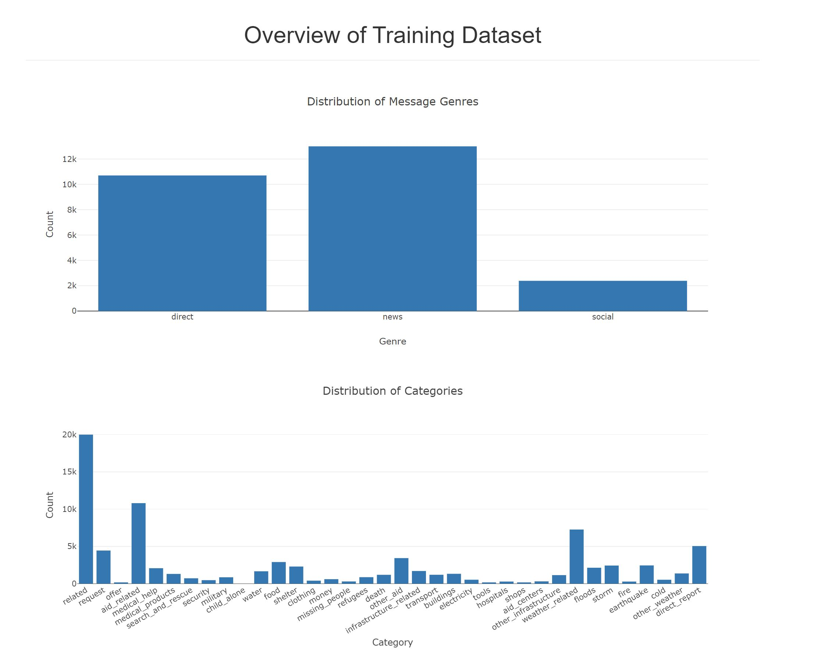
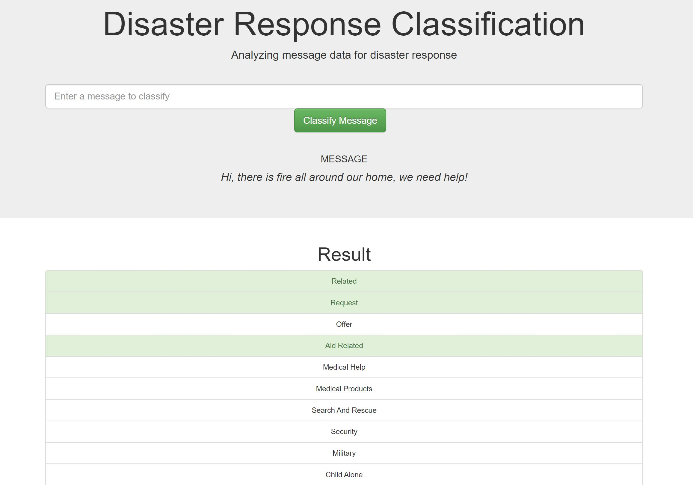

# Disaster Response Pipeline Project

## Project Overview:
This project includes a web app where an emergency worker can input a new message and get classification results in several categories. The web app will also display visualizations of the data.

The project is running live on: http://18.189.26.72/

### Instructions:
1. Run the following commands in the project's root directory to set up your database and model.

    - To run ETL pipeline that cleans data and stores in database\
        `python data/process_data.py data/disaster_messages.csv data/disaster_categories.csv data/DisasterResponse.db`
\
    

    - To run ML pipeline that trains classifier and saves\
        `python models/train_classifier.py data/DisasterResponse.db models/classifier.pkl`
\
    
\
        

2. Run the following command in the app's directory to run your web app.
    `python run.py`

3. Go to http://0.0.0.0:3001/
\
    
\
    
\
    

## Project Details:

### Extract, Transform and Load (ETL) Process
The first part of the data pipeline is the Extract, Transform, and Load process. Here, we are reading the dataset, cleaning the data, and then storing it in a SQLite database. The data cleaning is done with the help of Pandas. Then this cleaned data is loaded into the sql lite database.

First, we convert the category attributes to actual category names by applying a tranformation.\
`category_colnames = row.apply(lambda x: x[:-2])`

Then we delete the original categories column from the dataset.\
`del df['categories']`

During the cleaning phase of the data, some exploratory analysis was done. In this analysis, it was known that one of the categories called 'related' had some bad data with respect to classification classes. In this data, we are supposed to deal with 0 and 1 as two classes for each category, but the 'related' category had '2' as well. Understanding that '2' is not 0 so it should be 1, an attempt is made to convert all the 2's within the 'related' class to 1.\
`categories.loc[categories['related'] == 2, 'related'] = 1`

Finally, we combine all these transformations into a single dataframe, drop the duplicate records and save to the SQLite Database.\
`Database Name: DisasterResponse.db` \
`Table Name: figure-eight`

### Machine Learning Pipeline
For the machine learning part, we splitted the data into a training set and a test set. Then, we created a machine learning pipeline that uses NLTK, as well as scikit-learn's Pipeline and GridSearchCV to output a final model that uses the message column to predict classifications for 36 categories (multi-output classification). Finally, we export the model to a pickle file.

At the beginning, we load the data from our SQLite database. There is one important thing to note in here, under the category 'child_alone' there were only instances of class 0 and no any instance of class 1. This would definitely add the overhead for traning the model given the current data and therefore, for the training purpose we are not using this category as of now. Although, we don't delete it from the original database since we aim to keep the system scalable so that if new class gets added to this category, we can use it to re-train our model.

The next important thing we do is to tokenize the input text and perform necessary cleaning on the data. It includes detecting URLs in the messages, lemmatizing the words and cleaning our individual tokens.

Thirdly, we build our machine learning model using Stochastic Gradient Descent (SGD) approach. This approach was chosen after evaluating the performance of several other classification algorithms namely Random Forest, k-NN, Naive Bayes. It was observed that SGD approach had higher precision, recall and accuracy measures than the rest of the algorithms and was much faster to train. Furthermore, we carried out GridSearchCV to find out the optimal hyperparameters to tune our SGD model. Once the optimal parameters were known, we build our model around these parameters.

Later, we evaluate our model using the classification_report in scikit-learn and calculate the precision, recall, f-score and accuracy for each class.

Finally, we fit the model into our training dataset and once the training is complete, save it to the 'classifier.pkl' pickle file.

### Flask App
Now, we display our results in a Flask web app. Here's the file structure of the project:

📦DisasterResponseDataPipeline\
 ┣ 📂app\
 ┃ ┣ 📂templates\
 ┃ ┃ ┣ 📜go.html\
 ┃ ┃ ┗ 📜master.html\
 ┃ ┗ 📜run.py\
 ┣ 📂data\
 ┃ ┣ 📜DisasterResponse.db\
 ┃ ┣ 📜disaster_categories.csv\
 ┃ ┣ 📜disaster_messages.csv\
 ┃ ┗ 📜process_data.py\
 ┣ 📂models\
 ┃ ┣ 📜classifier.pkl\
 ┃ ┗ 📜train_classifier.py\
 ┗ 📜README.md\
